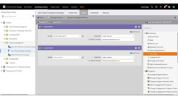
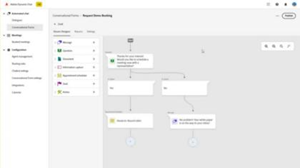
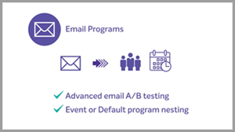

# [!DNL Marketo Engage] Tutorials

Browse our tutorial library and get the most out of [!DNL Marketo Engage]. These tutorials can help supplement [[!DNL Marketo] product documentation](https://experienceleague.adobe.com/docs/marketo/using/home.html){target="_blank"} to help you improve your understanding of marketing automation features. 

<!-- 

 
-->

## What's new {#whats-new}

* [Template import](/help/main/shorts/template-import.md)
_Learn how to import your existing email templates from the classic editor into the Email Designer, preserving your designs and accelerating template creation.._

* [AI Assistant for Email Designer](/help/main/shorts/ai-assistant-email-designer.md)
_Use AI Assistant in the Marketo Engage Email Designer to help you create contemporary, performant, and intuitive emails._

* [Conditional content](/help/main/shorts/conditional-content)
_Learn how to dynamically control what content is seen by which audience._

## Most popular videos {#most-popular-videos}

<table>
<tr>
<td>

<a href="https://experienceleague.adobe.com/en/docs/marketo-learn/tutorials/programs-and-campaigns/smart-campaigns-101"><strong>Smart Campaigns 101</strong></a>

</td>
<td>

<a href="https://experienceleague.adobe.com/en/docs/marketo-learn/tutorials/dynamic-chat/conversational-forms"><strong>Conversational Forms</strong></a>

</td>
<td>

<a href="https://experienceleague.adobe.com/en/docs/marketo-learn/tutorials/fundamentals/programs-and-campaigns"><strong>Understanding Marketo programs and campaigns</strong></a>

</td>
</tr>
</table>
