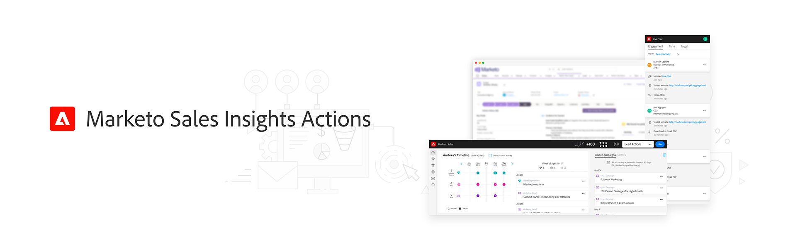
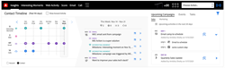
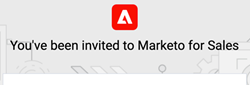
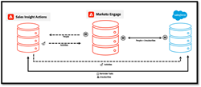

# Sales Insight Actions Tutorials

Use Sales Insight Actions to accelerate prospecting efforts with marketing-powered intelligence and engagement tools together in a single workflow.

>[!AVAILABILITY]
>
>This feature is currently on limited GA. Please reach out to your Customer Success Manager or email `sales-insights(at)adobe(dot)com` to request access.

## Featured Tutorials {#featured-tutorials}

<table style="table-layout:fixed">
<tr>
<td>

<a href="https://video.tv.adobe.com/v/340917"><strong>Sales Insight Actions Overview</strong></a>

<em>Accelerate prospecting efforts with marketing-powered intelligence and engagement tools.</em>

</td>
<td>

<a href="https://video.tv.adobe.com/v/340925"><strong>Accessing Your Sales Insight Actions Instance</strong></a>

<em>Blurb.</em>

</td>
<td>

<a href="https://video.tv.adobe.com/v/340843"><strong>Configure Sales Activity Logging to Salesforce</strong></a>

<em>Blurb.</em>

</td>
</tr>
</table>

## Featured Articles {#featured-articles}

<table style="table-layout:fixed">
<tr>
<td>

<a href="https://experienceleague.adobe.com/docs/marketo/using/product-docs/marketo-sales-insight/actions/sales-insight-actions-feature-overview.html"><strong>Sales Insight Actions Feature Overview</strong></a>

<em>Blurb.</em>

</td>
<td>

<a href="https://experienceleague.adobe.com/docs/marketo/using/product-docs/marketo-sales-insight/actions/getting-started/sales-insight-actions-user-onboarding-guide.html"><strong>Sales Insight Actions User Onboarding Guide</strong></a>

<em>Blurb.</em>

</td>
<td>

<a href="https://experienceleague.adobe.com/docs/marketo/using/product-docs/marketo-sales-insight/actions/admin/actions-data-sync-faq.html"><strong>Actions Data Sync FAQ</strong></a>

<em>Blurb.</em>

</td>
</tr>
</table>

## Personalized Support {#personalized-support}

To receive personalized support for this feature, please [schedule a call](https://outlook.office365.com/owa/calendar/AdobeInc1@adobe.onmicrosoft.com/bookings/) with the Product Team.

## Report a Bug/Feedback {#report-a-bug-feedback}

If you encounter a bug, or have some general feedback on this feature, please email us at `sales-insights(at)adobe(dot)com`.
